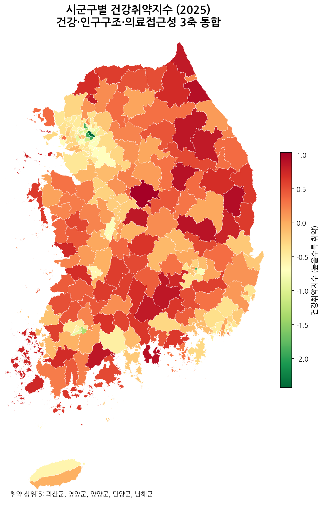
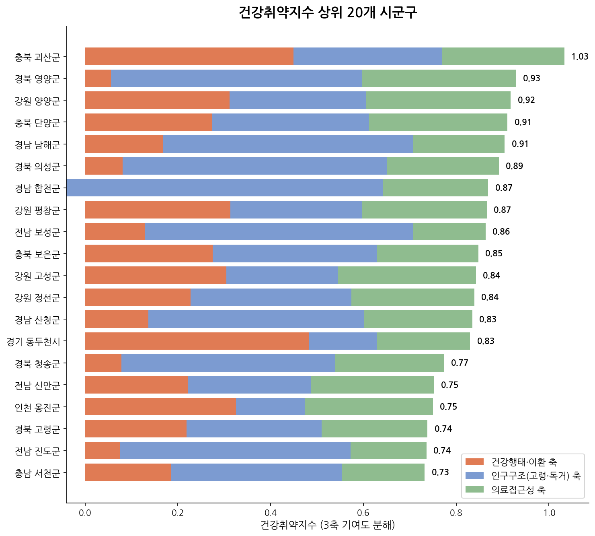
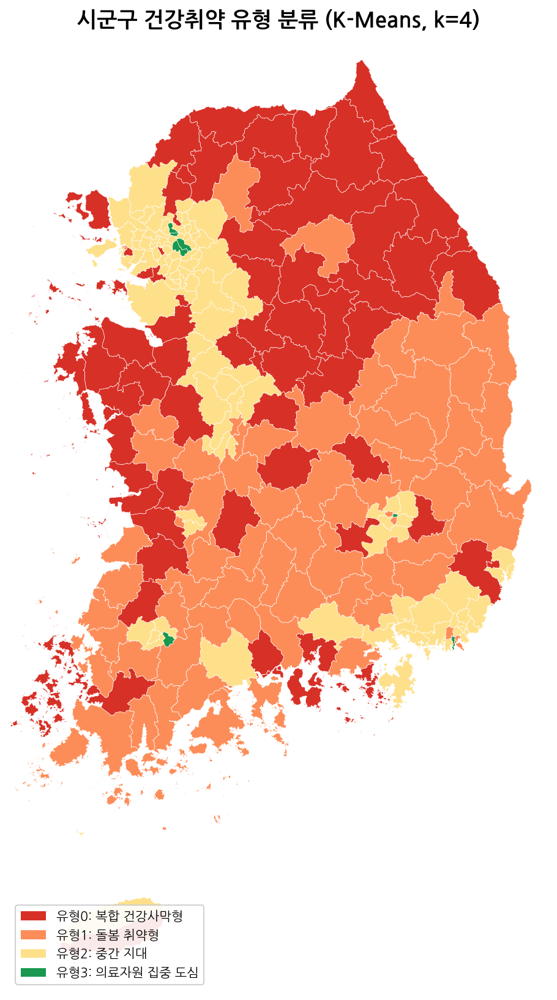
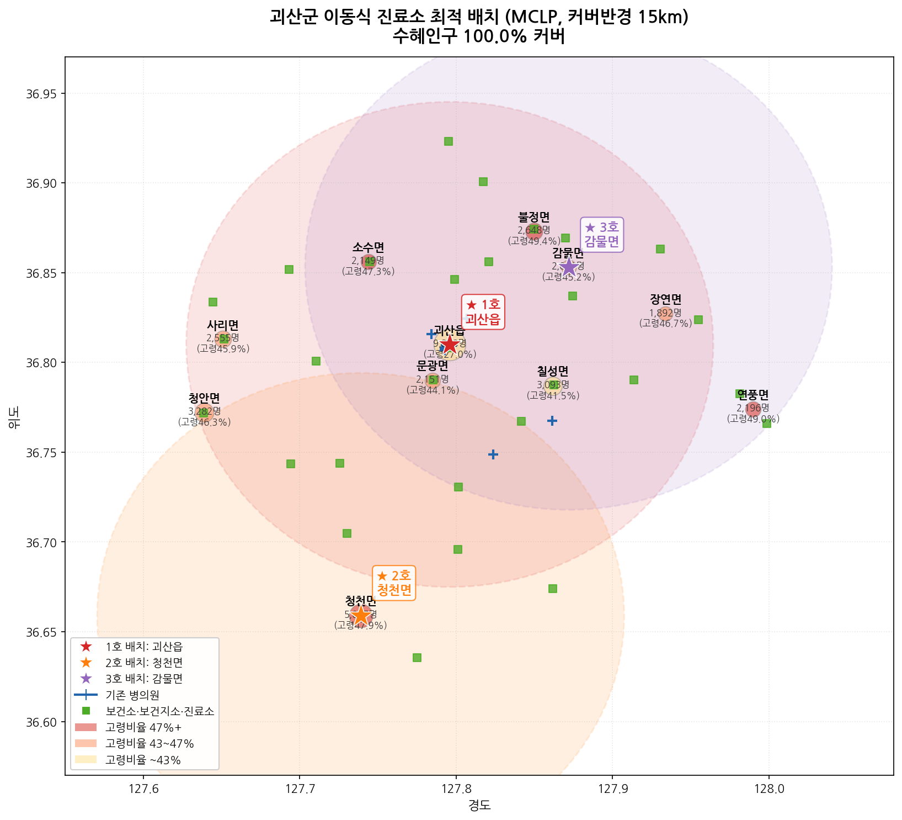

# 🏥 AI 기반 건강사막(Health Desert) 탐지 및 보건 인프라 최적 입지 선정

> 공공데이터 4종을 융합하여 전국 229개 시군구의 건강취약지수를 산출하고,  
> K-Means 군집화로 건강사막 유형을 분류한 뒤, MCLP 알고리즘으로 이동식 진료소 최적 배치 좌표를 도출한 B2G 데이터 분석 프로젝트

<br>

## 📌 목차
1. [프로젝트 개요](#-프로젝트-개요)
2. [주요 결과](#-주요-결과)
3. [데이터 출처](#-데이터-출처)
4. [분석 방법론](#-분석-방법론)
5. [폴더 구조](#-폴더-구조)
6. [기술 스택](#-기술-스택)
7. [한계 및 향후 과제](#-한계-및-향후-과제)

<br>

---

## 🔍 프로젝트 개요

### 배경
- 의료자원의 수도권 집중과 지방 고령화가 맞물리며 **'건강사막(Health Desert)'** 현상이 심화
- 전국 1인가구 800만 돌파, 65세 이상 독거노인 가구 급증 → 고독사·의료 사각지대 확대
- 지자체 예산 한계로 인해 **"어디에, 무엇을, 먼저"** 투자할지에 대한 데이터 근거 부재

### 해결 방안 (2단계 솔루션)

| 단계 | 내용 | 방법론 |
|------|------|--------|
| **1단계: 진단** | 전국 229개 시군구 건강취약지수 산출 및 유형 분류 | 3축 Z-score + K-Means |
| **2단계: 처방** | 취약 1위 지역(괴산군) 이동식 진료소 최적 배치 3곳 도출 | MCLP(최대 점유 입지 문제) |

<br>

---

## 📊 주요 결과

### 1단계: 건강사막 위험도 지도

전국 229개 시군구를 대상으로 **건강행태·이환 / 인구구조 / 의료접근성** 3축을 통합한 건강취약지수를 산출했습니다.



> 강원 내륙, 충북 남부, 경북 북부, 경남 서부의 농촌 군 지역이 고위험군으로 집중 확인

<br>

#### 취약지수 상위 20개 시군구 (3축 기여도 분해)



| 순위 | 시군구 | 취약지수 | 고령인구비율 | 천명당 의사수 | 유형 |
|------|--------|----------|------------|-------------|------|
| 1 | 충북 괴산군 | 1.03 | 40.6% | 0.77명 | 복합 건강사막형 |
| 2 | 경북 영양군 | 0.93 | 42.3% | 0.26명 | 돌봄 취약형 |
| 3 | 강원 양양군 | 0.92 | 34.7% | 0.18명 | 복합 건강사막형 |
| 4 | 충북 단양군 | 0.91 | 37.4% | 0.26명 | 복합 건강사막형 |
| 5 | 경남 남해군 | 0.91 | 42.1% | 0.77명 | 복합 건강사막형 |

> 💡 **강남구 천명당 의사수: 약 4.5명** vs **양양군: 0.18명** — 25배 격차

<br>

### 지역 유형 분류 (K-Means, k=4)



| 유형 | 시군구 수 | 특징 | 주요 지역 | 정책 방향 |
|------|----------|------|----------|----------|
| 🔴 복합 건강사막형 | 69곳 | 건강행태 악화 + 의료접근성 부족 동시 발생 | 괴산, 양양, 단양 | 이동식 진료소 + 건강행태 개선 |
| 🟠 돌봄 취약형 | 69곳 | 고령인구비율 평균 34.5%, 독거노인 집중 | 영양, 의성, 합천 | AMI 연계 안부 모니터링 시범사업 |
| 🟡 중간 지대 | 84곳 | 상대적으로 양호한 중소도시권 | 충주, 아산 | 예방적 건강관리 |
| 🟢 의료자원 집중 도심 | 7곳 | 천명당 의사수 평균 11명 | 강남, 종로 | - |

<br>

### 2단계: 이동식 진료소 최적 입지 선정 (괴산군 파일럿)

취약지수 전국 1위 **괴산군**을 대상으로 이동식 진료소 3대를 배치했을 때 수혜 인구가 극대화되는 좌표를 MCLP 알고리즘으로 산출했습니다.



| 호 | 배치 위치 | 위도 | 경도 | 커버 인구 |
|----|----------|------|------|----------|
| ★ 1호 | 괴산읍 | 36.810°N | 127.796°E | 중심권 9,218명 포함 다수 |
| ★ 2호 | 청천면 | 36.659°N | 127.739°E | 남서 외곽권 5,057명 |
| ★ 3호 | 감물면 | 36.853°N | 127.872°E | 동북 외곽권 2,011명 |

- **커버 반경**: 15km (이동식 진료소 운영 가능 거리)
- **수혜 인구 커버율**: **100%** (36,252명 전원)
- 기존 병의원 8개소는 모두 괴산읍 중심에 집중 → 외곽 읍면은 보건진료소만 존재

<br>

---

## 📁 데이터 출처

| 데이터 | 출처 | 기준연도 | 활용 내용 |
|--------|------|----------|----------|
| 지역사회건강조사 시군구별 통계 | 질병관리청(KDCA) | 2025 | 건강행태·이환 지표 8종 (표준화율) |
| 주민등록연앙인구 (시군구·읍면동별) | 행정안전부 / KOSIS | 2024 | 총인구, 65세 이상 고령인구 |
| 성 및 연령별 1인가구 (시군구별) | 통계청 인구총조사 / KOSIS | 2024 | 1인가구수, 65세 이상 독거노인 가구수 |
| 전국 병의원 및 약국 현황 | 건강보험심사평가원(HIRA) | 2026.3 | 전국 의료기관 79,562개소 위치·의사수 |

> ⚠️ 원본 데이터는 각 출처에서 직접 다운로드 필요 (개인정보·라이선스 이슈로 미포함)

<br>

---

## 🔬 분석 방법론

### 3축 건강취약지수 산출

```
취약지수 = (건강축 + 인구축 + 접근성축) / 3
```

각 축은 소속 지표를 Z-score 표준화 후 평균:

**건강행태·이환 축** (8개 지표)
- 현재흡연율, 고위험음주율, 비만율, 우울감경험률
- 고혈압·당뇨병 진단경험률, 미충족의료율 (+방향)
- 걷기실천율 (−방향, 높을수록 양호)

**인구구조 축** (2개 지표)
- 고령인구비율 (65세 이상 / 총인구)
- 독거노인비율 (65세 이상 1인가구 / 65세 이상 인구)

**의료접근성 축** (3개 지표, 부호 반전)
- 인구 천명당 병의원수
- 인구 천명당 의사수
- 십만명당 종합병원수

<br>

### K-Means 군집화

- **입력**: 위 13개 지표 전체 (StandardScaler 표준화)
- **k=4** 선택 (Elbow Method 기반)
- **결과**: 4개 유형으로 229개 시군구 분류

<br>

### MCLP (Maximum Coverage Location Problem)

```
목적함수: 커버반경(15km) 내 수혜 인구(총인구 + 65세이상 × 1.5 가중) 최대화
제약조건: 이동식 진료소 3대 배치
알고리즘: Greedy (매 스텝 추가 수혜 최대 위치 선택)
```

- 괴산군 11개 읍면 중심 좌표 + 심평원 의료기관 좌표 활용
- 읍면 간 거리: Haversine 공식 적용

<br>

---

## 📂 폴더 구조

```
health-desert-korea/
│
├── README.md
│
├── assets/                          # README에 삽입된 이미지
│   ├── 지도1_취약지수.png
│   ├── 지도2_클러스터유형.png
│   ├── 차트_취약지수_상위20.png
│   └── 괴산군_MCLP_최적입지.png
│
├── data/
│   └── output/                      # 분석 결과 데이터 (원본 데이터는 미포함)
│       ├── 최종_통합테이블_3축취약지수.csv    # 229개 시군구 × 28개 컬럼
│       └── 건강조사_2025_시군구_취약지수포함.csv
│
├── notebooks/                       # 분석 코드
│   ├── 01_data_preprocessing.py     # 4개 데이터 정제 및 병합
│   ├── 02_vulnerability_index.py    # 3축 취약지수 산출
│   ├── 03_kmeans_clustering.py      # K-Means 군집화
│   ├── 04_mclp_optimization.py      # MCLP 최적 입지 선정
│   └── 05_visualization.py          # 지도·차트 시각화
│
└── docs/
    └── 기획서_건강사막_통합시스템.docx
```

<br>

---

## 🛠 기술 스택

| 분류 | 사용 기술 |
|------|----------|
| 언어 | Python 3.12 |
| 데이터 처리 | pandas, numpy |
| 머신러닝 | scikit-learn (K-Means, StandardScaler) |
| 공간 분석 | scipy (Haversine 거리), MCLP Greedy |
| 시각화 | matplotlib, geopandas |
| 지도 데이터 | GeoJSON (southkorea-maps, 시군구 경계) |
| 문서 | python-docx |

<br>

---

## ⚠️ 한계 및 향후 과제

**현재 한계**
- 건강지표(지역사회건강조사)의 최소 공표 단위가 시군구 → 읍면동 단위 건강지표 정밀화 불가
- 의료접근성 축은 행정구역 내 기관 수 기준 → 실제 도로망 기반 접근 시간 미반영
- MCLP 커버 반경(15km)은 직선거리 기준 → 산간 도로 우회 시 실제 접근 가능 거리와 차이 발생

**향후 과제**
- [ ] 심평원 기관별 좌표 활용한 도로망 기반 접근 시간(등시선 분석) 고도화
- [ ] 읍면동 인구·1인가구 데이터 확보 시 2단계 해상도 전국 확장
- [ ] 클러스터 1(돌봄 취약형) 지역 대상 AMI 기반 독거노인 안부 모니터링 시범사업 연계 설계

<br>

---

## 👥 팀 구성

| 역할 | 담당 |
|------|------|
| 1단계: 건강사막 탐지 (데이터 수집·분석·시각화) | 가원 |
| 2단계: 안부 모니터링 시스템 설계 | 팀원 |

<br>

---

## 📎 관련 링크

- 질병관리청 지역사회건강조사: https://chs.kdca.go.kr
- KOSIS 국가통계포털: https://kosis.kr
- 건강보험심사평가원 공공데이터: https://opendata.hira.or.kr

<br>

---

*분석 기준일: 2026년 7월 | 데이터 기준: 지역사회건강조사 2025, 인구통계 2024, 의료기관 현황 2026.3*
